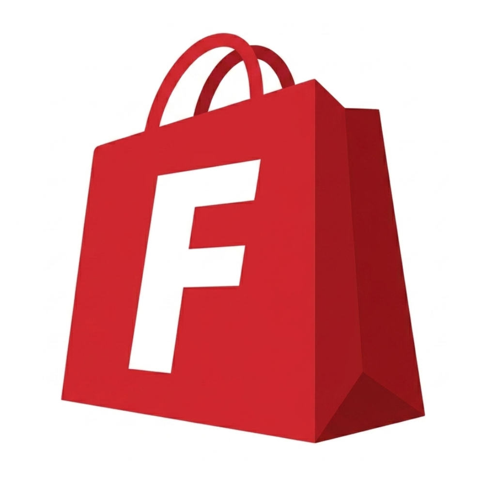
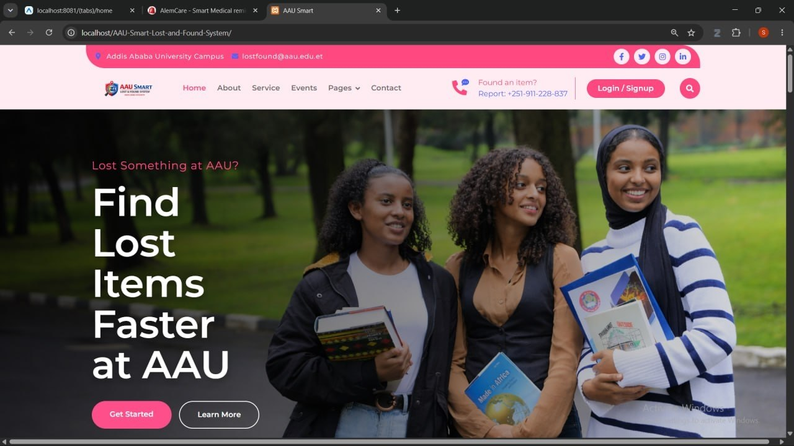

<div align="center">

<p align="center">
  
</p>

[](https://git.io/typing-svg)

</div>

---


### 👋 About Me

```typescript
const sophonyas = {
  role: "Full-Stack Web & Mobile Developer",
  location: "Addis Ababa, Ethiopia 🇪🇹",
  education: "3rd Year Addis Ababa University Stuudent @ AAU (2024–2027)",
  building: "FitGo Delivery — fashion delivery platform",
  passions: [
    "UI / UX",
    "AI-powered products",
    "Cloud infrastructure",
    "Scalable systems architecture",
  ],
  goal: "Grow FitGo into a funded, multi-city business 🚀",
};
```

<br clear="right"/>

---

### 🛠️ Tech Stack

<div align="center">

**Frontend & Mobile**


**Backend & Database**


**Cloud & DevOps**


**Design & AI**


</div>

---

### 🚀 Projects

<table>
  <tr>
    <td width="50%" valign="top">
      <h3 align="center">🛵 FitGo Delivery</h3>
      <div align="center">
        
        <br/><br/>
        
        <br/><br/>
        <p align="left">A startup-grade on-demand <strong>fashion delivery platform</strong> serving Addis Ababa. Built with pixel-perfect React Native UIs connected to a PostgreSQL-backed REST API — 3 repos, 3 user roles, live on Vercel + Railway.</p>
        <br/>
        
        <br/><br/>
        
        
        
      </div>
    </td>
    <td width="50%" valign="top">
      <h3 align="center">🔍 AAU Lost & Found System</h3>
      <div align="center">
        
        <br/><br/>
        
        <br/><br/>
        <p align="left">A university portal system developed for <strong>Addis Ababa University</strong> — a smart lost and found platform integrated into the AAU ecosystem, enabling students and staff to report and recover lost items efficiently.</p>
        <br/>
        
        
      </div>
    </td>
  </tr>
</table>

---

### 📊 GitHub Stats
<p align="center">
  
</p>
---

### 🏆 Highlights

- 🎓 **3rd-year AAU student** shipping production apps — not just side projects
- 🔐 **Firebase Auth + PostgreSQL** hybrid auth system across mobile & web
- 🎨 **Full brand identity** — from logo to animated marketing site with scroll-triggered motion
- ☁️ **Cloud-native deployments** — Cloudinary CDN, Railway Procfile, env-var management
- 🤖 **AI integrations** — Anthropic Claude API for intelligent product features
- 🏛️ **Institutional project** — AAU Smart Lost & Found System for a real university portal

---

### 📬 Get In Touch

<div align="center">

[](mailto:contactsophonyas@gmail.com)
[](tel:+251906089808)
[](https://maps.google.com/?q=Addis+Ababa)

</div>

---

<div align="center">


*"Building products that matter, one commit at a time."*

</div>